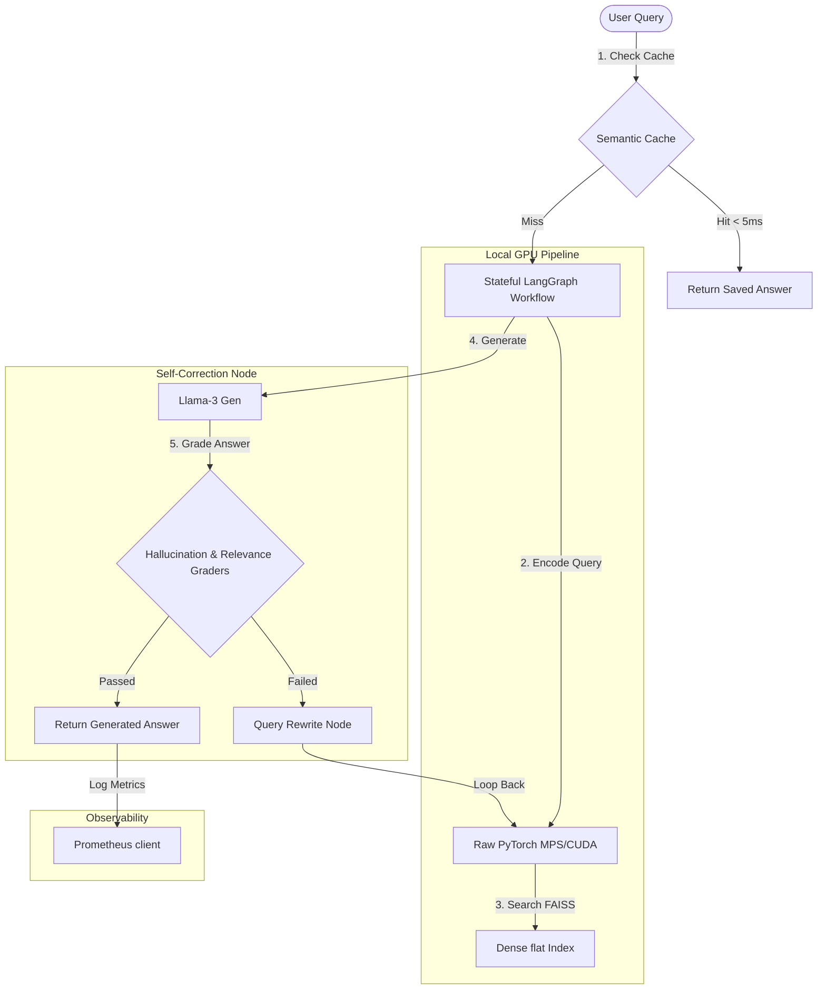

# KanonesKa: Advanced Production & AI-Agent Optimization
## Deep-Dive Technical Documentation (doc2.md)

This document details the second phase of development for KanonesKa: transitioning the system from a prototype RAG server to a high-performance, self-correcting AI-Agent platform optimized for GPU acceleration, latency minimization, and real-time observability.

---

## 🛠️ Phase 2 Architectural Upgrades



---

## 1. 🏎️ Raw PyTorch Accelerator Pipeline
To eliminate high-level library dependencies and optimize model runtimes, we implemented direct PyTorch code targeting hardware accelerators.
*   **Dynamic Device Mapping**: Detects and allocates tensor calculations to the optimal available accelerator:
    ```python
    device = torch.device("cuda" if torch.cuda.is_available() else "mps" if torch.backends.mps.is_available() else "cpu")
    ```
*   **Mean Pooling Math**: Implemented raw pooling on the token hidden states using attention masks:
    $$\text{Sentence Embedding} = \frac{\sum(\text{token\_embeddings} \times \text{attention\_mask})}{\sum(\text{attention\_mask})}$$
*   **L2 Normalization**: Executed $L_2$ normalization on vectors in memory via PyTorch function `F.normalize(..., p=2, dim=1)` to ensure correct Cosine Similarity flat calculations.

---

## 2. ⚡ L1/L2 Semantic Caching System
A multi-tier caching system was developed in [semantic_cache.py](file:///Users/mandeepray/Downloads/traffic_rules_assistant-main/src/semantic_cache.py) to minimize LLM and retriever executions for repetitive queries:
1.  **L1 Cache (In-Memory)**: Stores query-answer pairs and their embedding vectors in Python lists. Performs fast cosine calculations on incoming queries to detect matching matches in under $0.5$ms.
2.  **L2 Cache (Redis)**: Persists cache entries in a local Redis database instance. On startup, L1 is hydrated directly from Redis.
3.  **Threshold (0.96)**: Only query vectors with a Cosine Similarity score of $\ge 0.96$ trigger cache hits.
4.  **Graceful Degradation**: If Redis connection fails, the cache degrades automatically to L1 memory-only mode without crashing the server.

---

## 🤖 3. Self-Correcting Agent loops (Self-RAG)
Orchestrated via **LangGraph**, the generation pipeline now validates its own responses prior to delivery:
*   **Hallucination Grader Node**: Instructs the LLM to inspect the generated response and compare it against the source context documents, outputting a binary `yes`/`no` score.
*   **Relevance Grader Node**: Grades if the answer directly addresses the traveler's question.
*   **Query Rewrite Node**: If checks fail, a query expansion node rewrite optimizes terms for database searching, looping the workflow back to the retriever.
*   **Loop Controller**: Restricts self-corrections to a maximum count of 2 to avoid infinite network loops.

---

## 📈 4. Prometheus Metrics & Observability Telemetry
To monitor the system health, we integrated `prometheus-client` in [api/app.py](file:///Users/mandeepray/Downloads/traffic_rules_assistant-main/api/app.py) and exposed raw metric targets under `/metrics`:
*   `kanoneska_requests_total`: Tracks overall queries mapped to status codes (200/500).
*   `kanoneska_semantic_cache_total`: Tracks the count of hit/miss statuses.
*   `kanoneska_request_latency_seconds`: Precise distribution histograms monitoring API runtimes.
*   **Vite + React Integration**: Displays a prominent green **⚡ SEMANTIC CACHE HIT** badge inside the UI sources accordion if the latency was resolved instantly from the cache.
