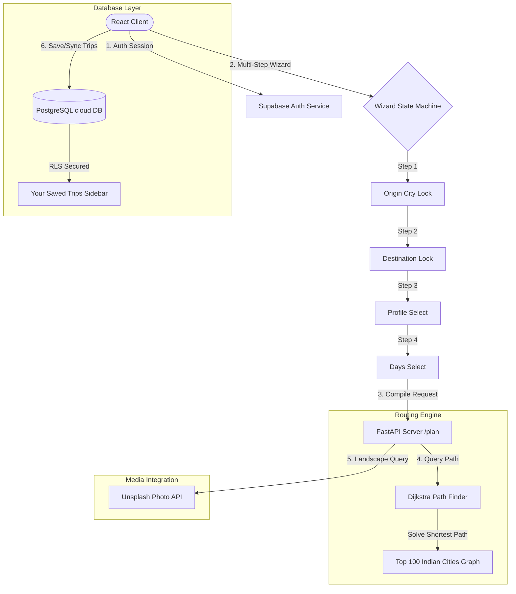

# KanonesKa: Cloud Database Sync & Advanced Flight Routing Wizard
## Deep-Dive Technical Documentation (doc3.md)

This document details the third phase of development for KanonesKa: transitioning the system from a single-city search bot to a stateful, multi-leg travel planner integrated with cloud-synchronized user authentication, a Dijkstra-based routing graph covering India's top 100 cities, and media enrichment pipelines.

---

## 🛠️ Phase 3 Architectural Upgrades

---

## 1. 🛫 Dijkstra Shortest-Path Flight Router
We built a dynamic flight search engine in [`src/flight_router.py`](file:///Users/mandeepray/Downloads/traffic_rules_assistant-main/src/flight_router.py) connecting any of India's top 100 cities to international gateways:
*   **Automatic Connectivity Graph**: City connections map local airports directly to primary gateway hubs (Delhi `DEL`, Mumbai `BOM`, Kolkata `CCU`, Bangalore `BLR`, Bhubaneswar `BBI`), which route onward to major global hubs (Singapore `SIN`, Kuala Lumpur `KUL`, Dubai `DXB`, etc.).
*   **Dijkstra Finder**: Resolves the cheapest sequence of flights in under $10$ms using priority queues (`heapq`).
*   **heapq Comparison Resolution**: To prevent python comparison type errors on identical cost entries, heap tuples are formatted with a unique incrementing sequence counter:
    $$\text{Tuple} = (\text{price}, \text{unique\_counter}, \text{airport\_code}, \text{flight\_path})$$

---

## 2. 🎨 Unsplash Landscape Media Engine
To enrich RAG-synthesized itineraries with immersive imagery:
*   **Unsplash Helper**: Created [`src/unsplash_helper.py`](file:///Users/mandeepray/Downloads/traffic_rules_assistant-main/src/unsplash_helper.py) fetching high-resolution landscape photos matched to the destination.
*   **Markdown Parsing**: Frontend matches cover photo tags (``) at the very top of Groq's markdown itineraries and extracts them programmatically to display them as full-width cover banners.

---

## 📅 3. Stateful Multi-Step Planning Wizard
The React client in [`App.jsx`](file:///Users/mandeepray/Downloads/traffic_rules_assistant-main/frontend_react/src/App.jsx) drives a comprehensive multi-step state machine:
*   **Wizard Step-by-Step Flow**:
    1.  *Step 1*: Prompts starting origin (locks starting point).
    2.  *Step 2*: Prompts dream destination.
    3.  *Step 3*: Selects travel profile (`Solo Female`, `Family`, `Couple`, `Duo`) to shape safety metrics.
    4.  *Step 4*: Prompts trip duration (selects via chips: `3`, `5`, `7`, `10` days or typing a custom integer).
5.  **Multi-Leg Extension**: Clicking "Yes, plan next leg!" initializes the next loop starting from the previous destination.

---

## 🔒 4. Supabase Auth & PostgreSQL Cloud Sync
Replaced local storage structures with client-side cloud auth and database persistence:
*   **Stunning Split Landing**: Displays a split authentication screen for unauthenticated users featuring an animated designer map graphic showing route networks and credential tabs.
*   **Dual Sign-In Fields**: Sign-up forms request **Username**, **Email**, and **Password**, while log-ins accept either email or username credentials.
*   **Inline Username Editing**: Users can double-click/click their user badge pill in the header to edit their name, invoking `supabase.auth.updateUser` to sync details instantly.
*   **RLS-Protected Saved Trips**: Saved itineraries sync directly to a Supabase database instance secured with Row-Level Security (RLS), restricting SELECT/DELETE/INSERT actions to the active authenticated user session.
