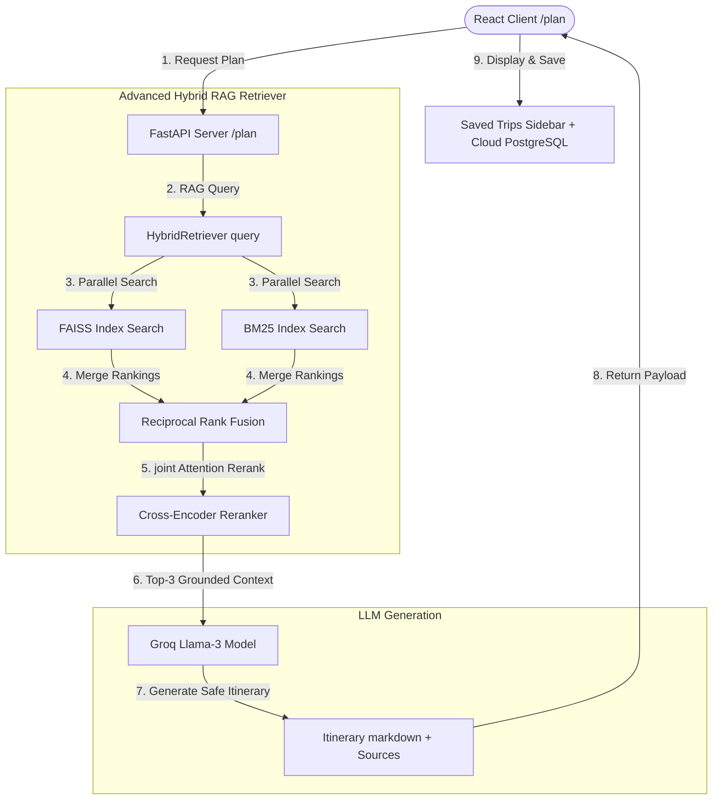

# KanonesKa: Production-Grade Hybrid RAG Plan Integration
## Deep-Dive Technical Documentation (doc4.md)

This document details the fourth phase of development for KanonesKa: the integration of the advanced, researcher-loved Hybrid RAG Pipeline directly into the travel planner wizard, enabling safety-grounded itinerary generation and real-time score auditing in the visual overlay modal.

---

## 🛠️ Phase 4 System Flow



---

## 1. 🔍 Grounded /plan Generation via Hybrid RAG
We replaced simple database key matching in the `/plan` endpoint with a state-of-the-art retrieval loop:
*   **Context Retrieval**: When a user requests an itinerary for a destination, the system triggers the `HybridRetriever` on the backend:
    ```python
    rag_results = generator.retriever.query(
        f"What are the travel safety rules, customs limits, visa fees, and vaping regulations in {request.destination}?",
        final_k=3
    )
    ```
*   **Prompt Grounding**: The retrieved text chunks are formatted and injected directly into the LLM system prompt under the `Retrieved Regulatory & Compliance Context (RAG)` section. This prevents Llama-3 from hallucinating local regulations, visa costs, or safety ratings.

---

## 📊 2. Sources Payload & Score Observability
To enable complete auditing of retrieval decisions:
*   **Schema Update**: Added `sources: List[SourceInfo]` to the `PlanResponse` schema to return dense vector similarity distances, BM25 exact-match statistics, and cross-encoder attention logits:
    *   `dense_score`: FAISS cosine similarity metric.
    *   `sparse_score`: BM25 term frequency metric.
    *   `rerank_score`: Cross-encoder joint relevancy logit.

---

## 🎨 3. Fullscreen Modal Data Binding
Wired the frontend to map and persist retrieved sources for travel itineraries:
*   **State Machine Mapping**: Updated `triggerPlanGeneration` inside `App.jsx` to load `data.sources` into the message feed state rather than displaying an empty array.
*   **Backward-Compatible Database Syncing**: To avoid altering existing PostgreSQL table schemas in Supabase, we serialize the retrieved `sources` directly inside the `flight_route` JSON payload when saving a trip. When loaded from the sidebar, it hydrates the sources trigger automatically:
    ```javascript
    sources: trip.flight_route.sources || []
    ```
*   **Visual Score Inspection**: Clicking "View Retrieved Compliance Sources (3)" on any planned itinerary overlay pulls up the widescreen modal, displaying Rerank, Dense, and Sparse scores for each grounding card.
