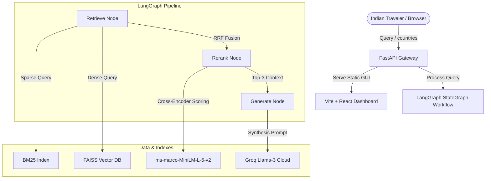

# KanonesKa: Outbound-India Travel Compliance RAG Assistant
## Technical Documentation & Architecture Manual

KanonesKa is a production-grade, stateful Retrieval-Augmented Generation (RAG) assistant designed to help outbound Indian travelers verify visa regulations, customs limits, local laws, and emergency protocols across 55 destinations.

---

## 🏗️ System Architecture

---

## 🧠 Key Features Implemented

### 1. Hybrid Retrieval Engine (Dense + Sparse Search)
Instead of relying solely on vector embeddings, KanonesKa implements a dual-mode search to ensure both keyword precision (essential for specific fine amounts or sections) and semantic understanding (essential for conversational queries):
*   **Dense Retrieval**: Uses the `all-MiniLM-L6-v2` SentenceTransformer to build a cosine-similarity index using **FAISS**.
*   **Sparse Retrieval**: Implements **BM25** (sparse keyword scoring) to match exact codes, numbers, and nouns.
*   **Reciprocal Rank Fusion (RRF)**: Fuses the rankings from both retrievers using a standard constant ($k=60$) to determine the top candidates.

### 2. Cross-Encoder Reranking
To optimize context density and minimize LLM input tokens, we process the top-10 hybrid search candidates through a **Cross-Encoder Model** (`cross-encoder/ms-marco-MiniLM-L-6-v2`). This model performs full attention-mechanism calculations on the question-document pair, returning a highly accurate relevance score and filtering candidate context down to the best 3 chunks.

### 3. Stateful Agentic Workflow (LangGraph)
The RAG pipeline is orchestrated as a stateful, modular graph workflow using **LangGraph**:
*   `State`: Manages the query, candidate chunks, final reranked chunks, and output generation.
*   `Retrieve Node`: Executes dense + sparse searches and combines them via RRF.
*   `Rerank Node`: Executes cross-encoder scoring and extracts the top-3 elements.
*   `Generate Node`: Calls ChatGroq (Llama-3) to synthesize the response.

---

## 🗃️ Compliance Database Schema

The database [travel_data.json](file:///Users/mandeepray/Downloads/traffic_rules_assistant-main/data/processed/travel_data.json) contains **55 countries** with **40 structured compliance columns** divided into:
1.  **Core Groundings**: Visa requirements, Customs duty-free cash/gold limits.
2.  **Connectivity & Logistics**: Local SIM availability, telecom providers, plug socket letters (e.g. Type G), voltage/hertz, WiFi speeds.
3.  **Finance & Shopping**: Local currency code, cash vs card reliance, local digital wallets, tipping rules, VAT/GST refund availability, minimum refund spend.
4.  **Navigation & Law**: Ride-hailing apps, metro availability, tourist passes, jaywalking law enforcement.
5.  **Emergency & Health**: Local police/medical hotlines, tap water potability, tourist scams, Indian embassy addresses, solo female safety ratings.
6.  **Taboos & Customs**: Dress codes, LGBTQ+ legal status, public displays of affection, drone/photography rules, vape legality.
7.  **Seasonal Factors**: Peak/shoulder months, monsoon periods, closures.
8.  **Food & Language**: Languages, English levels, vegetarian/vegan ease, Halal availability, alcohol purchase laws.

---

## 📊 Research & Validation Assets

*   **Synthetic Dataset Generator (`src/generate_eval_dataset.py`)**: Uses an LLM to scan the 55-country profiles and automatically generate **50+ Question-Context-Ground Truth triplets** for MLOps validation.
*   **Retrieval Ablation Study (`src/ablation_study.py`)**: Runs comparative evaluation cases to measure retrieval precision and latency across four configurations:
    1.  Dense-Only
    2.  Sparse-Only
    3.  Hybrid RRF
    4.  Hybrid + Reranker (Standard KanonesKa)
*   **LLM-as-a-judge Evaluator (`src/evaluator.py`)**: Computes core metrics (Faithfulness, Answer Relevance, and Retrieval Precision) to detect hallucinations.

---

## 💻 GUI Dashboard & Deployment

*   **Vite + ReactJS Front-End**: Implements a premium cosmic/oceanic travel dashboard. Includes:
    *   *Destinations Sidebar*: 55-country list with search-and-clear icons.
    *   *Middle Chat Canvas*: Scrollable agent chat showing response latencies and expandable metrics badges.
    *   *Right Snapshot Panel*: Displays a static **"TRAVEL FAR, STAY INFORMED"** welcome widget, which transitions into a detailed compliance card grid once a destination is searched or selected.
*   **Production Mount**: Mounted React's static `/dist` directory directly to FastAPI's `/gui` path.
*   **Dockerization**: Bundled with a custom `Dockerfile` and `docker-compose.yml` to package and run both the API and GUI in one command.
