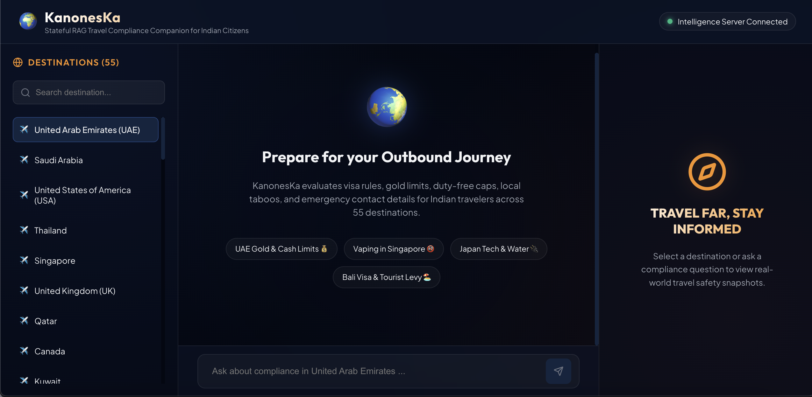
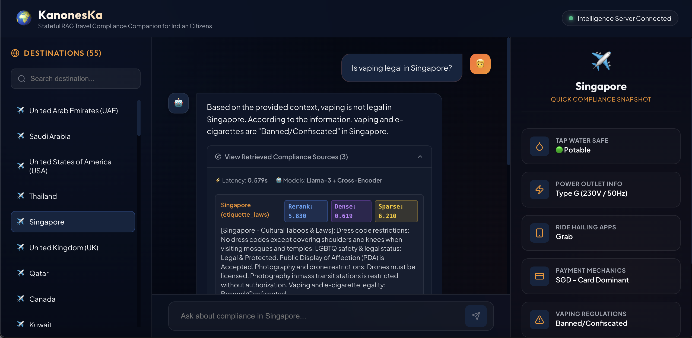
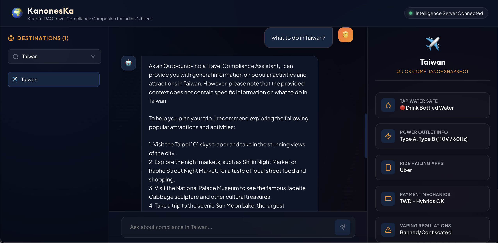
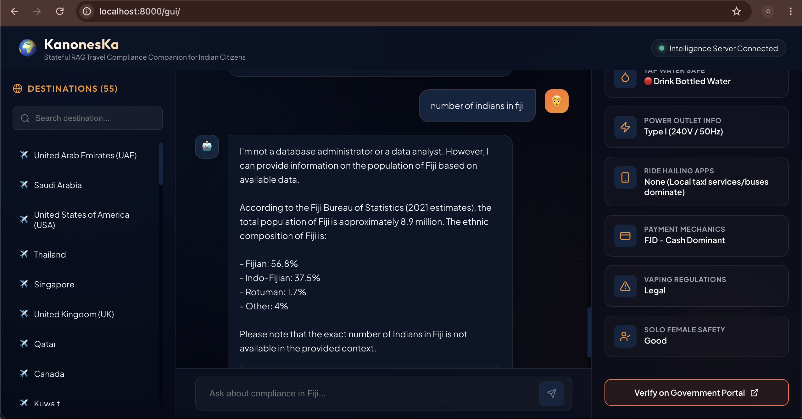
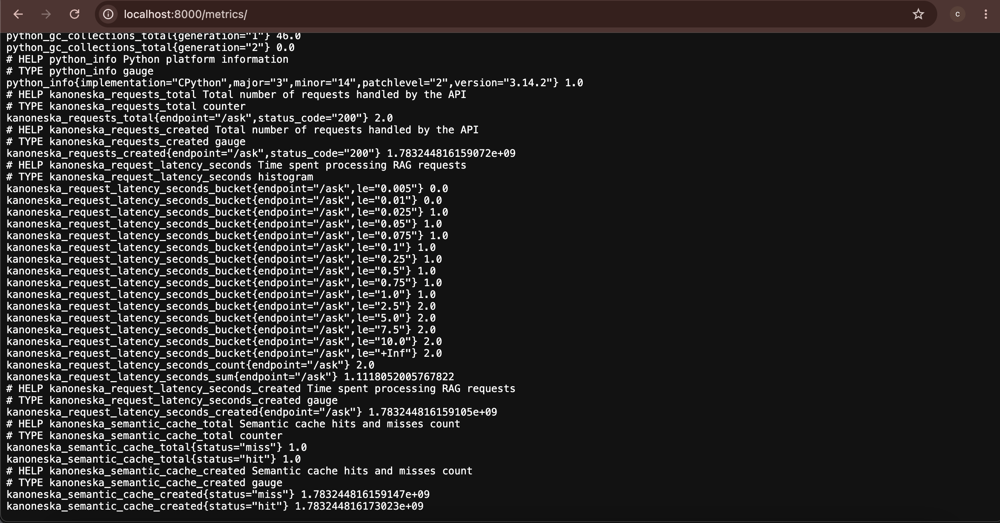
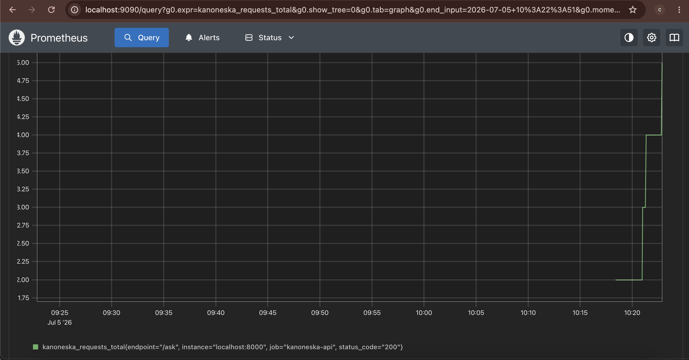

# 🌍 KanonesKa: Outbound-India Travel Compliance AI

<p align="center">

**Hybrid-RAG powered AI Travel Compliance & Intelligent Flight Planning Platform**

Built using **FastAPI • React • LangGraph • FAISS • BM25 • PyTorch • Groq • Supabase**

</p>

---

## 📖 About

**KanonesKa** is a Hybrid Retrieval-Augmented Generation (Hybrid-RAG) platform that helps Indian citizens plan international travel by answering country-specific compliance questions including:

- Visa regulations
- Gold & customs limits
- Duty-free allowances
- Local laws
- Safety advisories
- Multi-leg flight planning

Instead of relying on a single retrieval strategy, KanonesKa combines **Dense Retrieval (FAISS)** and **Sparse Retrieval (BM25)** using **Reciprocal Rank Fusion (RRF)** before reranking results with a **Cross Encoder**, producing grounded and explainable responses.

The platform also includes a **stateful travel planning wizard** that computes optimal multi-leg flight routes from India's Top 100 cities using **Dijkstra's Shortest Path Algorithm**, while securely synchronizing itineraries through **Supabase PostgreSQL**.

---

# 🚀 Features

### 🔍 Hybrid Retrieval

- FAISS Dense Vector Search
- BM25 Keyword Retrieval
- Reciprocal Rank Fusion (RRF)
- Cross-Encoder Reranking

### 🤖 AI Pipeline

- LangGraph Stateful Workflow
- Groq Llama-3
- Self-Correction Loops
- Grounded Responses

### ✈️ Travel Planner

- Multi-Step Wizard
- Dijkstra Flight Routing
- Top 100 Indian Cities
- Multiple Traveller Profiles

### ☁️ Cloud

- Supabase Authentication
- PostgreSQL Database
- Row-Level Security
- Saved Travel History

### 📊 Monitoring

- Prometheus Metrics
- Request Monitoring
- Retrieval Latency

---

# 📸 Development Journey

KanonesKa evolved through multiple iterations—from a simple travel assistant to a production-ready Hybrid-RAG platform.

---

### Screenshots

<table align="center">
<tr>
<td align="center">

</td>

<td align="center">

</td>
</tr>

<tr>
<td colspan="2" align="center">

</td>
</tr>
</table>

# 🚀 Version 1 — Foundation

Version 1 established the core architecture of the platform.

### Highlights

- Glassmorphic React UI
- Stateful Wizard
- Dijkstra Flight Routing
- Initial Groq Integration
- Basic RAG Responses

### Wizard Flow

```text
Origin
   ↓
Destination
   ↓
Traveller Profile
   ↓
Trip Duration
   ↓
Generate Itinerary
```

---

### Screenshots

<table align="center">
<tr>
<td align="center">

</td>

<td align="center">

</td>
</tr>

<tr>
<td colspan="2" align="center">

</td>
</tr>
</table>


# 🚀 Version 2 — Production Hybrid-RAG

Version 2 transformed KanonesKa into a production-ready AI platform with explainable retrieval, secure authentication, and cloud persistence.

### Highlights

- 🔐 Supabase Authentication
- 🔍 Visual Hybrid-RAG Inspector
- ☁️ Cloud Saved Trips
- 🧠 LangGraph Self-Correction
- 📊 Retrieval Transparency

### New Features

#### 🔐 Authentication

- Login & Registration
- Supabase Auth
- Animated Landing Page

#### 🔍 Visual RAG Inspector

Inspect exactly how an answer was generated by viewing:

- FAISS similarity scores
- BM25 keyword scores
- Retrieved documents
- Final reranked context

#### ☁️ Cloud Sync

Travel plans can be:

- Saved
- Retrieved
- Deleted

using **Supabase PostgreSQL** protected with **Row-Level Security (RLS).**

#### 🧠 LangGraph Workflow

```text
User Query
     │
     ▼
Hybrid Retrieval
     │
     ▼
Document Grading
     │
     ▼
Hallucination Check
     │
     ▼
Answer Rewrite
     │
     ▼
Grounded Response
```


---

# 🧠 Hybrid-RAG Architecture

```text
                 User Query
                      │
                      ▼
              Query Embedding
                      │
        ┌─────────────┴─────────────┐
        ▼                           ▼
  Dense Retrieval              Sparse Retrieval
      (FAISS)                      (BM25)
        │                           │
        └─────────────┬─────────────┘
                      ▼
        Reciprocal Rank Fusion (RRF)
                      │
                      ▼
         Cross Encoder Re-ranking
                      │
                      ▼
            LangGraph Workflow
                      │
                      ▼
                Groq Llama-3
                      │
                      ▼
               Final Response
```

---

# 🛠 Tech Stack

| Category | Technologies |
|-----------|--------------|
| Backend | FastAPI, LangGraph |
| Frontend | React, JavaScript, CSS |
| AI | Groq, Llama-3 |
| ML | PyTorch, Transformers |
| Retrieval | FAISS, BM25, RRF |
| Database | PostgreSQL (Supabase) |
| Authentication | Supabase Auth |
| Monitoring | Prometheus |

---

# 📁 Repository Structure

```text
KanonesKa/
├── api/
│   └── app.py
│
├── src/
│   ├── hybrid_retriever.py
│   ├── flight_router.py
│   ├── generator.py
│   ├── semantic_cache.py
│   └── unsplash_helper.py
│
├── frontend_react/
│   ├── src/
│   ├── package.json
│   └── App.jsx
│
├── Docs/
│   ├── Pics/
│   │   ├── Version1/
│   │   └── Version2/
│   ├── doc2.md
│   ├── doc3.md
│   ├── doc4.md
│   └── final_research_documentation.md
│
├── requirements.txt
└── README.md
```


# ⚙️ Installation

## Prerequisites

- Python **3.11+**
- Node.js **18+**
- Git
- Groq API Key
- (Optional) Supabase Project
- (Optional) Unsplash API Key

---

## Clone Repository

```bash
git clone https://github.com/Mandy1200/KanonesKa.git

cd KanonesKa
```

---

## Create Virtual Environment

### macOS / Linux

```bash
python3 -m venv .venv

source .venv/bin/activate
```

### Windows

```powershell
python -m venv .venv

.venv\Scripts\Activate.ps1
```

---

## Install Dependencies

```bash
pip install -r requirements.txt
```

---

## Frontend Setup

```bash
cd frontend_react

npm install

npm run build

cd ..
```

---

# 🔑 Environment Variables

Create a `.env` file in the project root.

```env
GROQ_API_KEY=your_groq_api_key

UNSPLASH_ACCESS_KEY=your_unsplash_key

SUPABASE_URL=your_supabase_url

SUPABASE_ANON_KEY=your_supabase_anon_key
```

---

# ▶️ Run the Application

Start the FastAPI server:

```bash
uvicorn api.app:app --host 0.0.0.0 --port 8000 --reload
```

Open:

```
http://localhost:8000/gui
```

---

# 🌐 API Endpoints

| Endpoint | Method | Description |
|-----------|--------|-------------|
| `/ask` | POST | Hybrid-RAG Assistant |
| `/plan` | POST | Flight Planner |
| `/metrics` | GET | Prometheus Metrics |
| `/gui` | GET | Web Interface |

---

# 📂 Documentation

Detailed implementation is available in the `Docs/` folder.

| File | Description |
|------|-------------|
| `doc2.md` | Hybrid Retrieval |
| `doc3.md` | Flight Routing |
| `doc4.md` | LangGraph Workflow |
| `final_research_documentation.md` | Complete Project Documentation |

---

# 🤝 Contributing

Contributions are welcome.

```bash
# Fork

git checkout -b feature/new-feature

git commit -m "Add new feature"

git push origin feature/new-feature
```

Open a Pull Request.

---

# 🙏 Acknowledgements

Built using:

- FastAPI
- React
- PyTorch
- LangGraph
- FAISS
- BM25
- Hugging Face Transformers
- Groq
- Supabase
- Prometheus

---

# ⭐ Support

If you found this project useful, consider giving it a ⭐ on GitHub.

---

<p align="center">

**Made with ❤️ using FastAPI, React, LangGraph, FAISS, BM25, PyTorch, Groq and Supabase**

</p>

---
